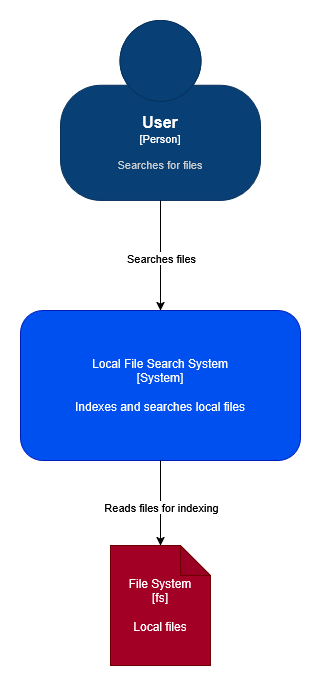
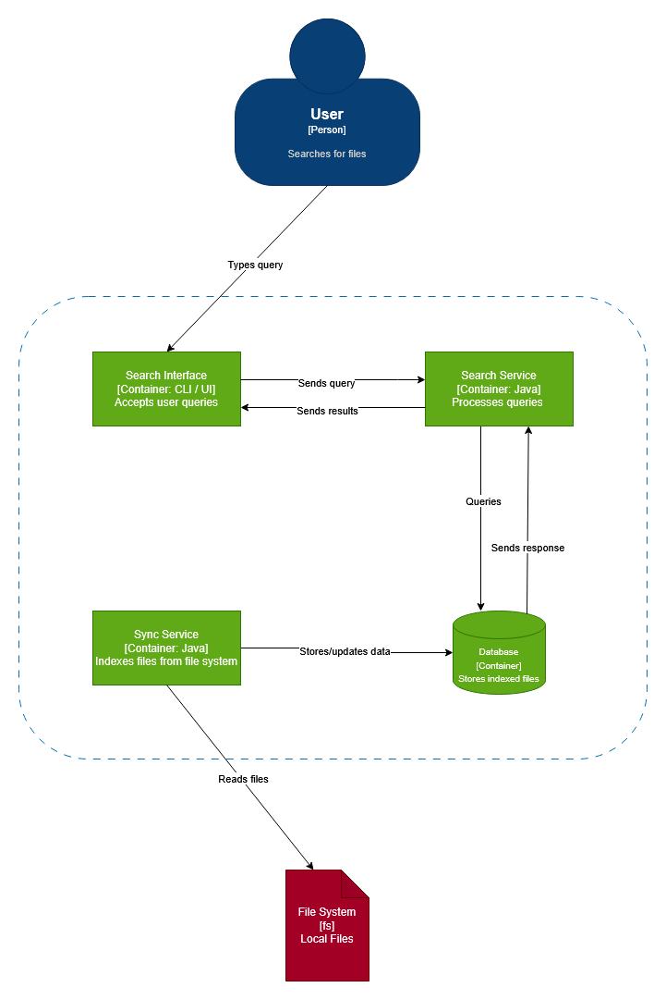
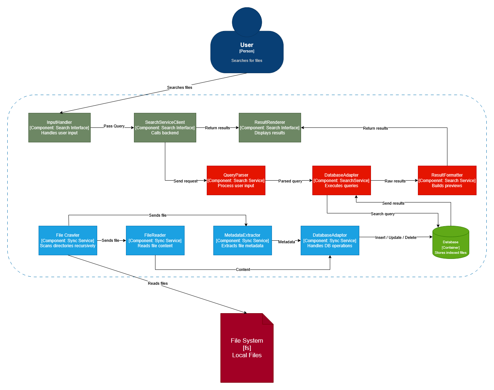

# Architecture Overview

## 1. Introduction

This project implements a **Local File Search System** that indexes files from the local file system and enables fast, full-text search over their content and metadata.

The system is designed following the **C4 model**, separating responsibilities between user interaction, data ingestion, and query processing.

---

## 2. System Context (C1)

At the highest level, the system interacts with:

- **User** – submits search queries and views results  
- **File System** – provides access to local files  

The system:
- reads files from the file system during indexing  
- processes search queries and returns results to the user  
- The database is internal to the system and is not shown at this level.

---

## 3. Container Diagram (C2)

The system is composed of four main containers:

### 3.1 Search Interface (CLI/UI)
- Accepts user queries  
- Displays search results  
- Sends raw input to the Search Service  

### 3.2 Search Service
- Handles query processing  
- Parses user input  
- Executes search queries against the database  
- Formats results before returning them  

### 3.3 Sync Service
- Responsible for indexing files  
- Crawls the file system  
- Extracts file content and metadata  
- Updates the database  

### 3.4 Database
- Stores indexed file data  
- Supports full-text search  
- Acts as the central data source for queries  

---

## 4. Component Diagram (C3)

### 4.1 Search Service Components

The Search Service is responsible for processing user queries and consists of:

- **QueryParser**
  - Interprets raw user input  
  - Transforms queries into a format suitable for the database  

- **DatabaseAdapter**
  - Executes search queries  
  - Communicates with the database  

- **ResultFormatter**
  - Processes raw database results  
  - Generates user-friendly output (e.g., previews)

---

### 4.2 Search Interface Components

- **InputHandler**
  - Captures user input  

- **SearchServiceClient**
  - Sends queries to the Search Service  

- **ResultRenderer**
  - Displays results to the user  

---

### 4.3 Sync Service Components

The Sync Service is responsible for building and maintaining the index:

- **FileCrawler**
  - Recursively scans directories  

- **FileReader**
  - Reads file content  

- **MetadataExtractor**
  - Extracts file metadata (size, timestamps, extension)  

- **DatabaseAdapter**
  - Inserts, updates, and deletes records in the database  

---

## 5. Data Flow

### 5.1 Indexing Flow (Ingestion)

1. Sync Service scans the file system  
2. Files are read and processed  
3. Content and metadata are extracted  
4. Data is stored in the database  

---

### 5.2 Search Flow (Query Processing)

1. User enters a query via the Search Interface  
2. Query is sent to the Search Service  
3. QueryParser processes the input  
4. DatabaseAdapter executes the query  
5. ResultFormatter prepares results  
6. Results are displayed to the user  

---

## 6. Design Decisions

### Separation of Concerns
- Indexing (Sync Service) is separated from searching (Search Service)  
- UI is decoupled from business logic  

### Database as Search Engine
- The system delegates indexing and search capabilities to the DBMS  
- Full-text search features are used instead of implementing custom indexing  

### Metadata Preservation
- All available metadata is stored for future extensibility  

### Modularity
- Components are loosely coupled and independently testable  

## 7. Summary

The architecture follows a clean separation between:
- **Data ingestion** (Sync Service)  
- **Query processing** (Search Service)  
- **User interaction** (Search Interface)  

The database acts as the central component enabling efficient search over indexed file data.